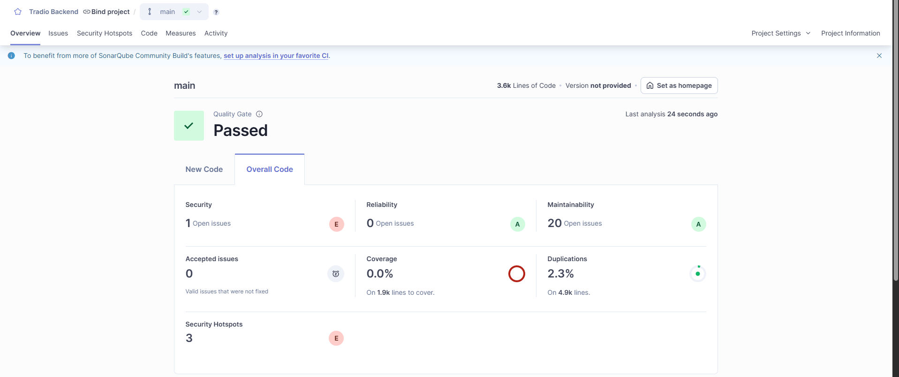
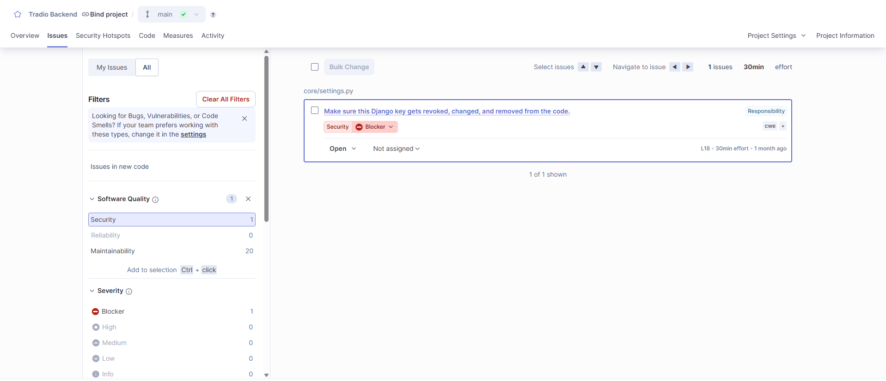
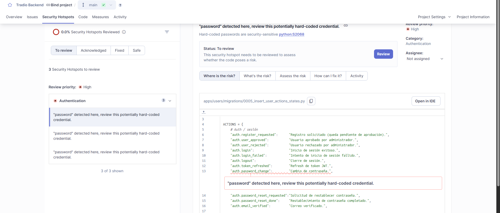
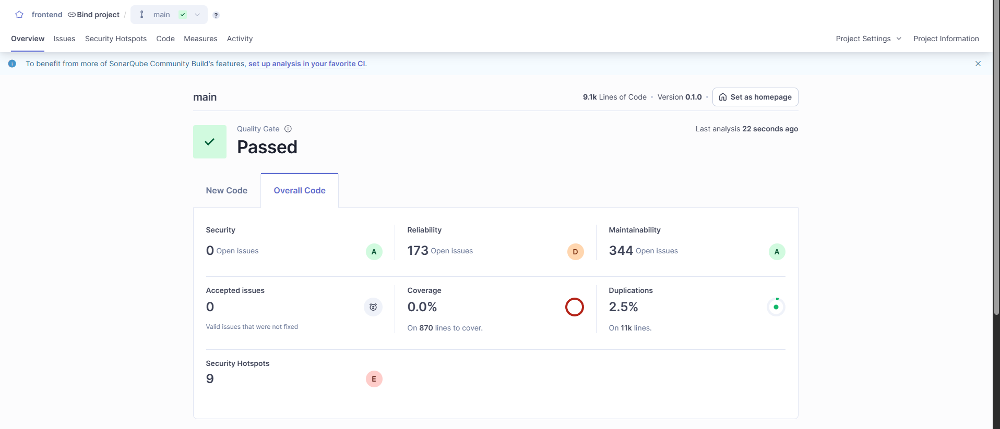
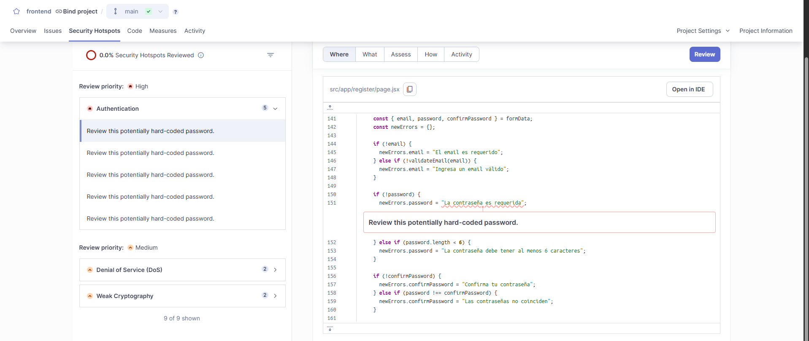

# SonarQube Code Analysis Results

## Backend Analysis Results

### Overall Analysis Summary

### Vulnerabilities Found

### Security Hotspots

---

## Frontend Analysis Results

### Overall Analysis Summary

### Security Hotspots

