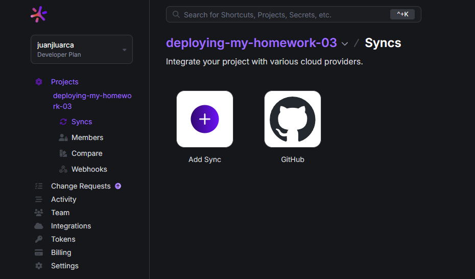
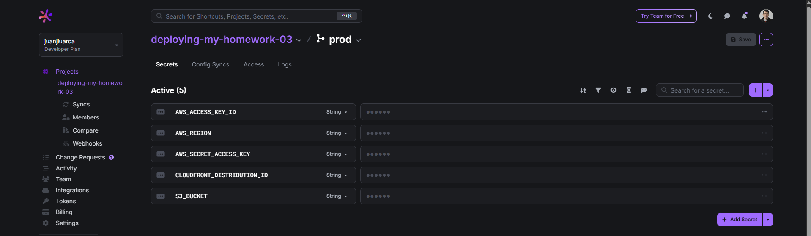
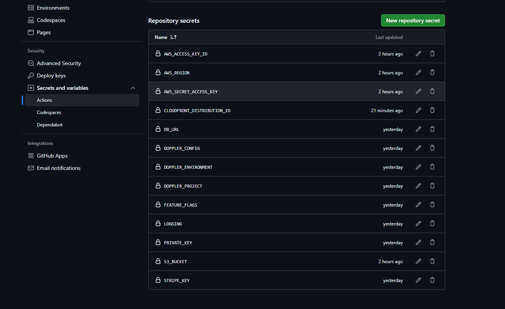

# Documentación de Integraciones y Despliegue

A continuación se presentan evidencias visuales y el acceso público a la aplicación desplegada.

---

## Integración Doppler con el Repositorio

Captura de pantalla de la pestaña **Config Syncs** en Doppler, donde se muestra la integración con el repositorio:

---

## Variables de Doppler

Captura de pantalla de las variables configuradas en Doppler (valores ocultos por seguridad):

---

## Secretos en GitHub

Captura de pantalla de los secretos configurados en GitHub:

---

## URL del CDN de CloudFront

URL pública del CDN para acceso al contenido desplegado:

[¡Click aquí para acceder al contenido desplegado!](https://d1s0uwqjop6nx.cloudfront.net/)
---
