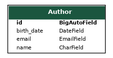
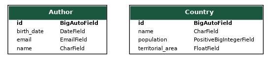
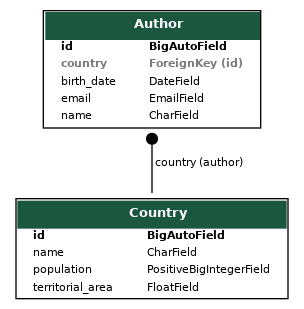
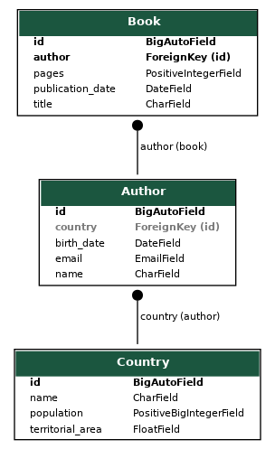
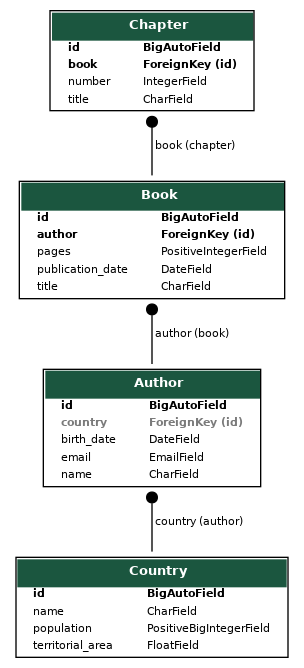
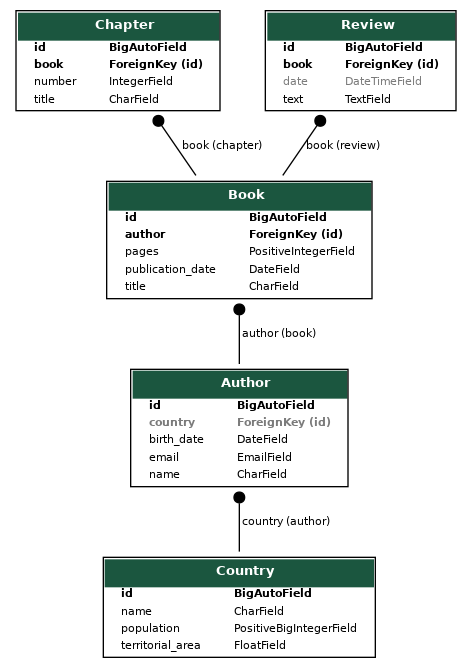

# Documentación de Migraciones y Diagramas - Homework-05

A continuación se presentan las evidencias gráficas de la evolución del modelo de datos, desde la primera migración hasta el modelo final.  
Cada diagrama corresponde a un estado del proyecto después de aplicar la respectiva migración.

---

## Diagrama 1: Modelo inicial (Author)

---

## Diagrama 2: Cargando modelo Country

---

## Diagrama 3: Modelo Author relación con Country

---

## Diagrama 4: Cargando modelo Book y relacionándolo con Author

---

## Diagrama 5: Cargando modelo Chapter y relacionándolo con Book

---

## Diagrama 6: Modelo final: cargando modelo Review y relacionándolo con Book

---
